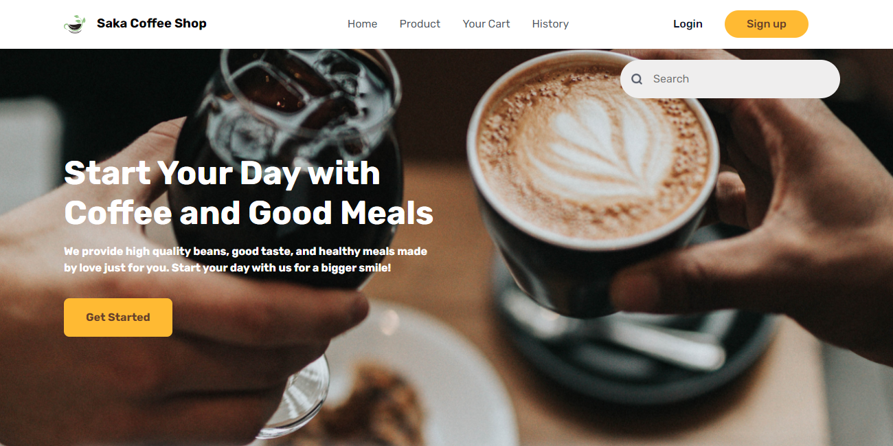
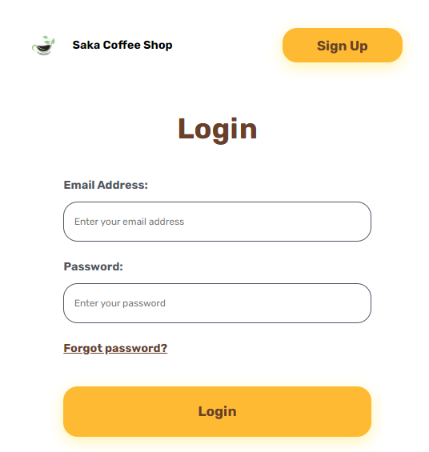
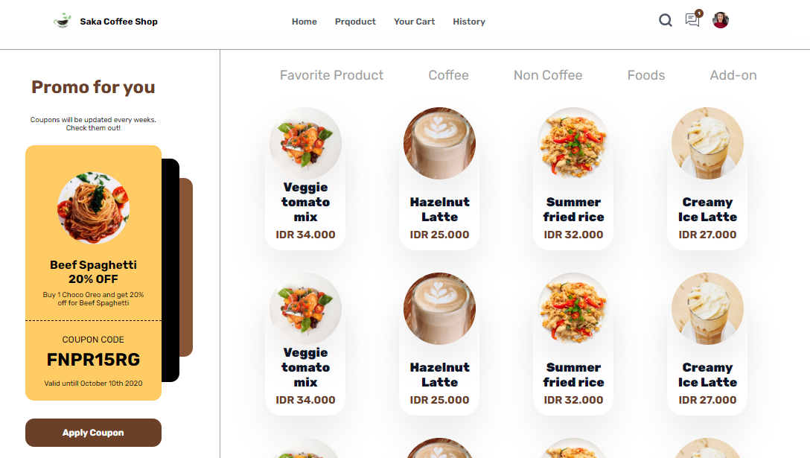

<h1 align="center">Saka Coffee Shop</h1>

  Built with Bootstrap

## Table of Contents

- [Introduction](#introduction)
- [Features](#features)
- [Requirements](#requirements)
- [Usage](#usage-for-development)
- [Screenshots](#screenshots)
- [Related Project](#related-project-backend)
- [Contributors](#contributors)

## Introduction

<b>Saka App</b> is an Web-Apps and Mobile Apps for Saka Coffee Shop.

## Features

- Login and Logout
- Order feature for user
- Payment feature
- History Transactions
- Etc

## Requirements

- [`bootstrap`](https://getbootstrap.com/)

## Usage for development

1. Open your terminal or command prompt
2. Type `git clone `
3. Open with your text editor
4. Start to edit and develop

## Screenshots

       
    
    

## Previous Project

- [`Backend Saka Coffee Shop`](https://github.com/zainulrofa/saka-coffee-shop.git)

## Contributors

  <table>
    <tr>
      <td align="center">
        <a href="https://github.com/zainulrofa">
           
          <b>Zainul Muhammad Rofa</b>
        </a>
      </td>
    </tr>
  </table>

